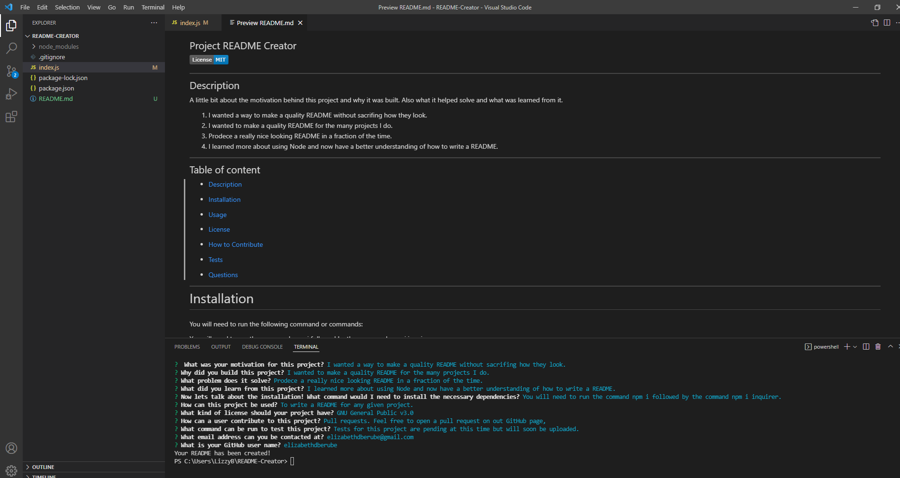

## README Creator

 ---  
 
## Description
A little bit about the motivation behind this project and why it was built. Also what it helped solve and what was learned from it.
1. I wanted a way to make a quality README for the many projects I do.
2. So I could save time on writing READMES.
3. It will produce a quality looking README in a fraction of the time.
4. I learned more about using Node and more about how to write a README.

---

## Table of content

* [Description](#description)

* [Installation](#installation)

* [Usage](#usage)

* [License](#license)

* [How to Contribute](#how-to-contribute)

* [Tests](#tests)

* [Questions](#questions)

---

# Installation 

You will need to run the following command or commands:

You will need to run the command npm i followed by npm i inquirer.

## Usage

To write a quality README for any given project.

## License

License for this project is set to MIT.

   
## How to Contribute

Pull requests. Feel free to open a pull requst on my GitHub.

## Tests

Tests for this project are pending but will soon be uploaded.

## Questions

If you have nay questions about this project then you can contact me directly at 

elizabethdberube@gmail.com

----
To see more of my work check out my GitHub

 [GitHub](https://www.github.com/elizabethdberube) 

----

To see a video of this being demonstrated follow this link:

[Screencastify](https://drive.google.com/drive/folders/111q4XMAyx5iarrUBsHIsW_93NX63eOHe?usp=sharing) 

----

 
